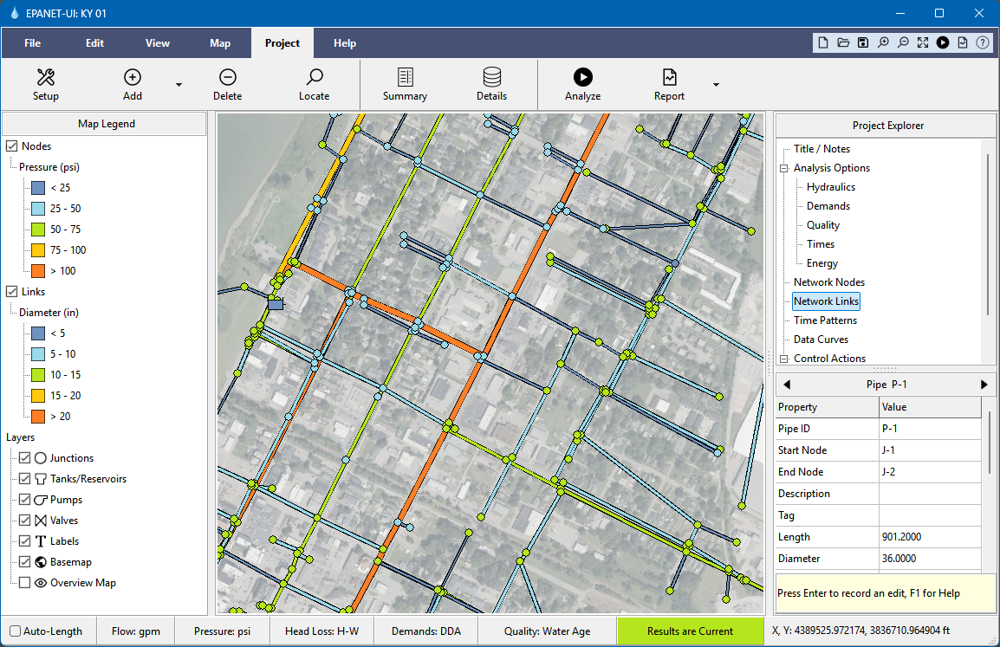

# EPANET Graphical User Interface

EPANET is an industry-standard software package for modeling water distribution systems. It simulates the hydraulic and water quality behavior of a pressurized pipe network over an extended period of time. This project introduces a new user interface for EPANET that:
- offers a modern and simple design
- runs on Windows, Linux and MacOS
- uses the latest OWA EPANET engine (v2.3) that can model pressure dependent demands and FAVAD pipe leakage
- has full support for EPANET's multi-species water quality (MSX) extension
- can import data from GIS shapefiles, DXF CAD files, and CSV text files
- can use web mapping services to provide dynamic background basemaps
- has multiple reporting options for simulation results, including energy audits, variability plots, and fire flow analysis. 

EPANET-UI executables for both Windows and Linux can be downloaded from  [here](https://sites.google.com/view/epanet-ui).
Ongoing development of the OWA EPANET engine can be found at [OWA EPANET](https://github.com/openwateranalytics/epanet).

